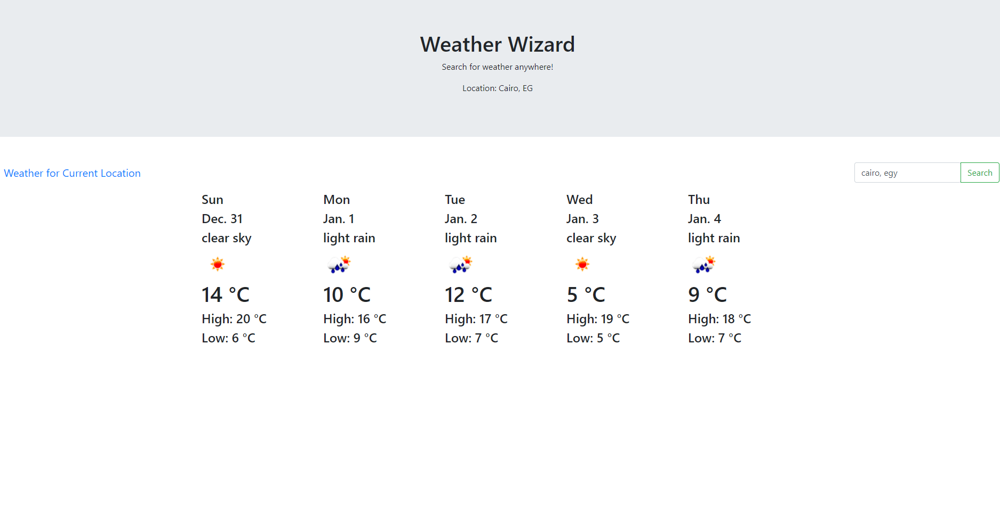

# WeatherWizard
Determine the 5-day weather forecast for a city by simply searching for it! This application will
show current temperature, maximum temperature, minimum temperature as well as the forecast for 5 days
in your current city or whichever city you want to search for.

Technologies Used:
- TypeScript
- HTML
- jQuery
- Bootstrap

# CURRENTLY REFACTORING CODE

# Steps for Loading in Browser
1) Finish writing code in script.ts
2) yarn build (compiles it into script.js)
3) browserify script.js -o bundle.js (bundles it into bundle.js so I can use "require" in browser)
